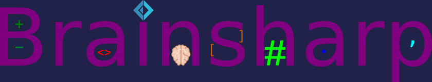

# Βrainsharp

## About
Brainsharp is a [brainfuck](https://en.wikipedia.org/wiki/Brainfuck) SDK written in F#.

It aims to be the fastest way to run brainfuck programs.

It has an ever-evolving interpreter with an optimizer and a native IL compiler to come.

## Download

You can get the stable release
[here](https://github.com/teo-tsirpanis/brainsharp/releases).

There is also a
[CI server](https://ci.appveyor.com/project/teo-tsirpanis/brainsharp)
ready to deliver the bleeding edge of Brainsharp's development.

## How to use
Just run `bsc --help` (or `mono bsc.exe --help` if you are on Linux) to learn it.

> Note: The command line parameters may change between versions.

> For your information, Brainsharp writes program output to stdout (if you have not specified the output in the command line) and messages to stderr.

## Status
* Interpreter: _Complete_
* Optimizer: _Complete. More optimizers are coming!_
* Compiler: _Initial work started_

## License
Brainsharp is licensed under the
[MIT License](https://github.com/teo-tsirpanis/brainsharp/blob/master/LICENSE).
